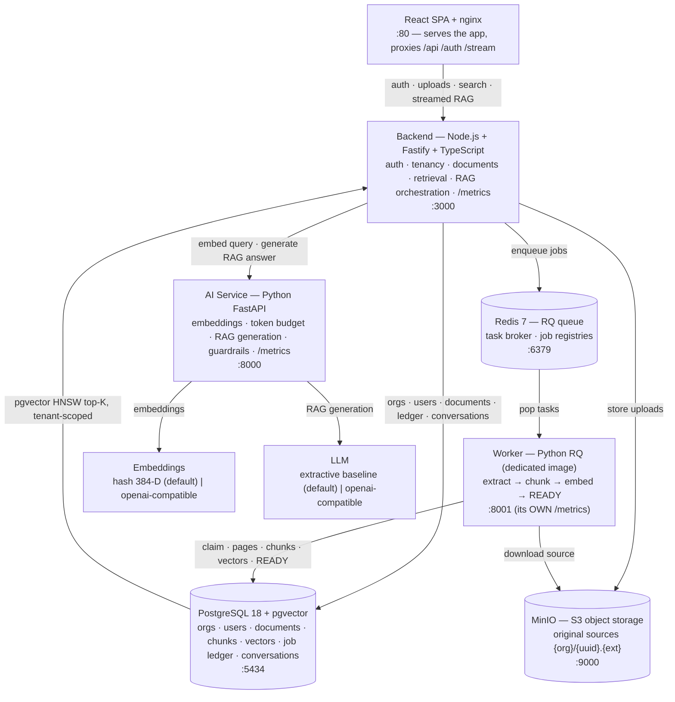
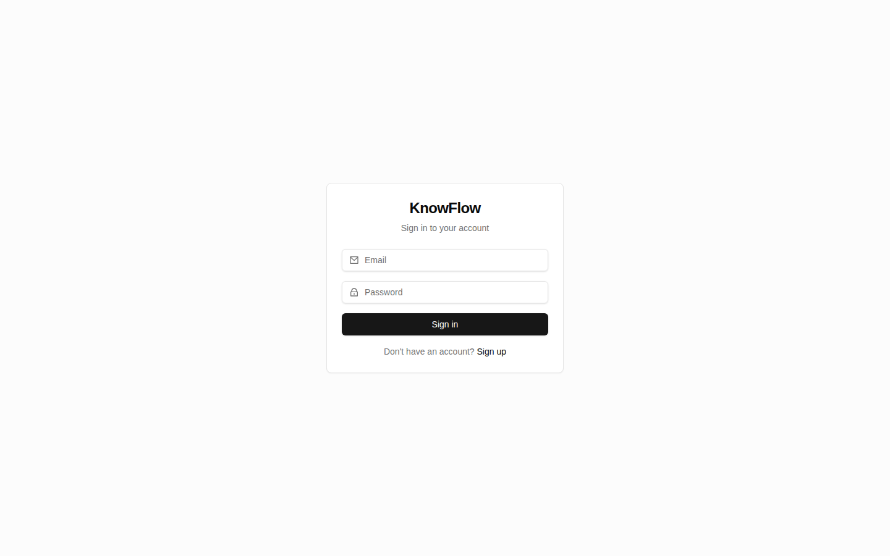
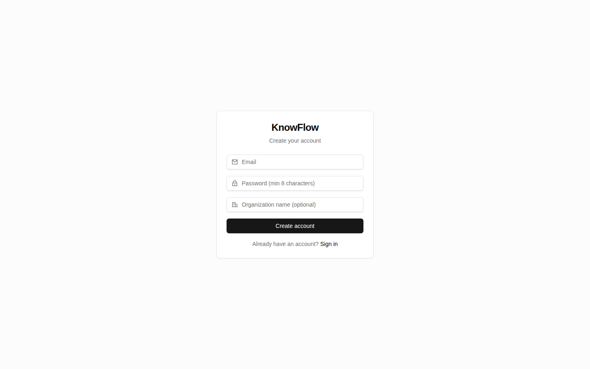
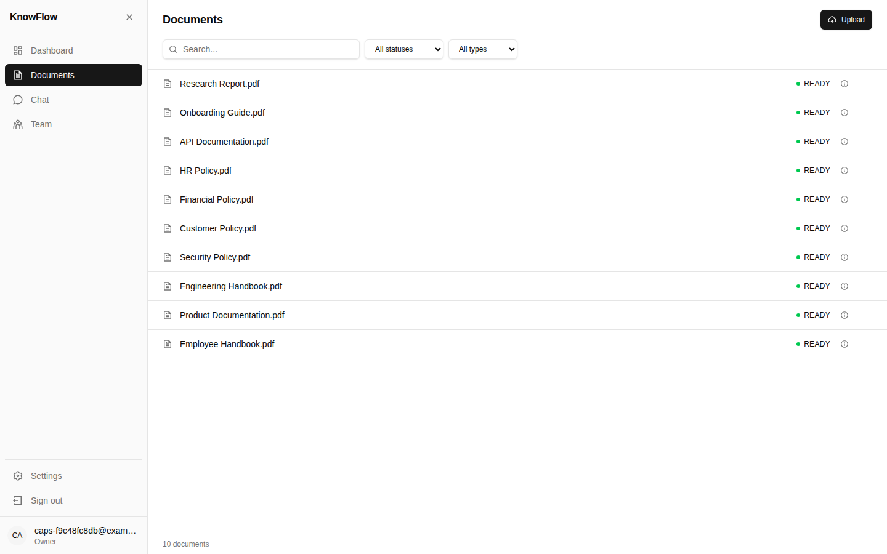
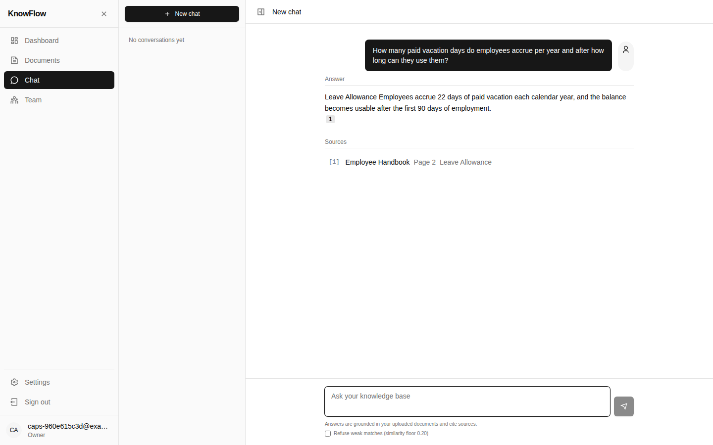
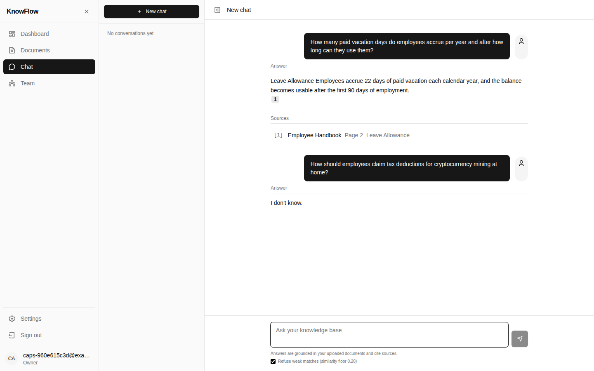
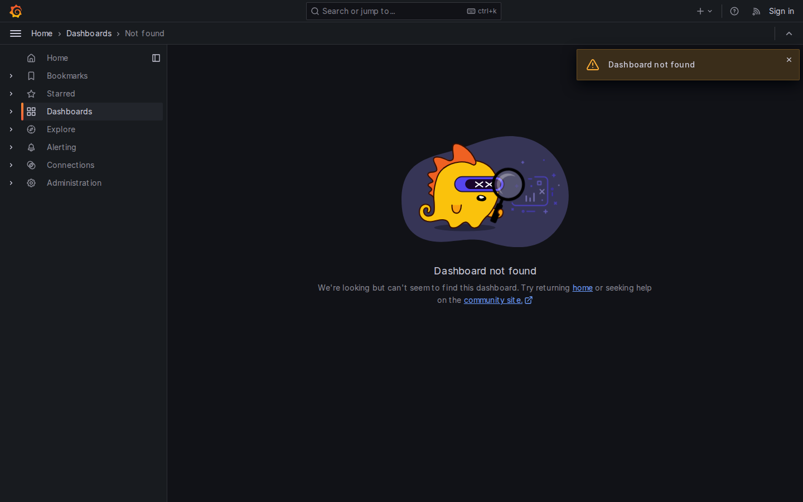
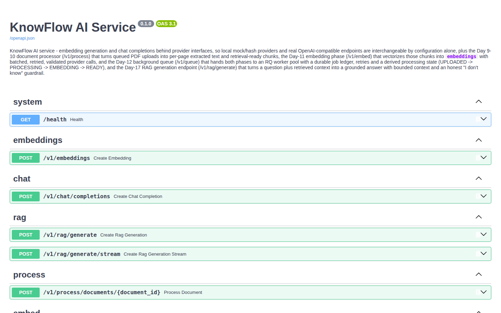

# KnowFlow

> **A multi-tenant AI knowledge platform — ingest documents, retrieve with
> vectors, answer with RAG, backed by citations, evaluation, and
> observability.** Built in 30 days as a production-shaped, test-pinned
> system, not a demo.

KnowFlow ingests documents (PDFs today, with the architecture wired for
more), pulls them through an asynchronous **extract → chunk → embed →
index** pipeline, and answers natural-language questions over them — every
answer cited against the source chunk it came from, permission-checked
inside the retrieval query itself.

This repository **is** the platform: an isolated multi-tenant service (not a
single-workspace demo) with authentication, a queued ingestion pipeline, RAG
generation, a golden evaluation harness, Prometheus/Grafana observability,
and a one-command deployment story.

---

## Table of contents

1. [The problem](#the-problem)
2. [Features](#features)
3. [Architecture](#architecture)
4. [Technology stack](#technology-stack)
5. [How RAG works here](#how-rag-works-here)
6. [Database design](#database-design)
7. [API](#api)
8. [Security](#security)
9. [Evaluation & results](#evaluation--results)
10. [Performance & scale](#performance--scale)
11. [Run it locally](#run-it-locally)
12. [Deployment](#deployment)
13. [Architecture decisions (ADRs)](#architecture-decisions-adrs)
14. [Screenshots](#screenshots)
15. [Demo video](#demo-video)

---

## The problem

Teams sit on piles of private documents (PDFs, policies, runbooks, specs).
Generic LLM chat cannot answer from them: the model never saw the data,
hallucinates freely, and would leak one tenant's documents into another's
answers. Manually curating FAQs does not scale.

KnowFlow makes documents **retrievable and answerable** — grounded answers
with citations, tenancy enforced in the query that feeds the model.

## Features

| Capability | What it means operationally |
|---|---|
| **Multi-tenant isolation** | Tenants share infrastructure, never data. Documents, chunks, vectors, conversations, and users are scoped to an org; retrieval applies the tenant filter *inside* the vector query. |
| **Asynchronous ingestion** | Upload → queued → processed out-of-band (`extract → chunk → embed → index`). The API returns fast; workers drain the queue. |
| **Semantic retrieval** | Questions become vectors; pgvector HNSW nearest-neighbor search over a 384-dim hashing embedder (swappable for OpenAI embeddings). |
| **RAG with citations** | Only retrieved, permission-filtered chunks enter the context. Answers cite the source document · section · page they came from. |
| **Refusal honesty** | When no retrieved chunk clears the confidence floor the model answers the canonical `"I don't know."` with `refused: true` — it never bluffs. Default is recall-first (`minSimilarity` 0, per the eval sweep); the chat UI's **"Refuse weak matches"** toggle sets the floor so the guardrail is exercisable without the API. |
| **Evaluation harness** | A golden corpus (deterministic PDFs with outline bookmarks) plus metric pins run in CI: recall/precision/hit, answer correctness, citation correctness, hallucination rate. |
| **Observability** | Every ingestion job and RAG request emits Prometheus metrics (backend :3000, ai-service :8000, worker :8001) on a provisioned Grafana dashboard. |
| **Authentication & teams** | JWT access + rotating refresh tokens, per-tenant registration, four-role orgs (OWNER > ADMIN > MEMBER > VIEWER), invitations. |
| **Conversations** | Multi-turn Q&A with history pinned to the tenant. |

## Architecture

System-design doc: [`docs/architecture.md`](docs/architecture.md) ·
API contract: [`docs/api.md`](docs/api.md)



Two data paths:

- **Documents** — React → API → MinIO (source), then Redis → worker →
  extract/chunk/embed → Postgres. The API doubles as the status reader.
- **Questions** — React → API → pgvector retrieval (tenant-scoped top-K) →
  AI service → (embeddings + LLM) → cited answer streamed back up the same
  path.

### Why these pieces

- **pgvector, not a separate vector DB** — vectors live beside their
  relational metadata, so tenant + permission filtering happens in *one*
  query with one transaction story ([ADR 001](docs/decisions.md)).
- **A queue, not synchronous processing** — documents are slow to chunk and
  embed; sync uploads would time out. RQ gives retries, backpressure, and a
  clean worker boundary ([ADR 002/004/007/008](docs/decisions.md)).
- **Two services, not one monolith** — Node owns auth/HTTP/tenancy, Python
  owns extraction/embedding/LLM. Each is the right tool for its job and they
  are decoupled by an HTTP contract ([ADR 003](docs/decisions.md)).
- **Permission filtering inside retrieval** — the tenant filter is part of
  the vector search SQL itself, so a caller literally cannot retrieve chunks
  they may not see, before the model ever sees a token
  ([ADR 009](docs/decisions.md)).
- **Citations as a product feature** — every claim resolves to document ·
  section · page; the answer is only as trustworthy as its source.

## Technology stack

_As built._ The Day-1 plan bet on FastAPI + SQLAlchemy + Celery/ARQ; the
as-built stack is below — the notable deltas are called out in the
[build log](docs/build-log.md).

| Layer | Choice | Notes |
|---|---|---|
| Frontend | React 18 + Vite + TypeScript, served by nginx | SPA, streaming chat via SSE |
| Backend API | Node.js 22 · Fastify · TypeScript · zod | parameterized SQL, no ORM, pino logging |
| AI service | Python 3.12 · FastAPI · Pydantic v2 | extraction, chunking, embeddings, RAG providers |
| Worker | Python · RQ (Redis Queue) · separate Docker image | scales independently; own /metrics on :8001 |
| Database | PostgreSQL 18 + pgvector 0.8.6 | HNSW index, migrations 001–011 |
| Queue | Redis 7 | RQ job broker + registries |
| Object storage | MinIO (S3-compatible) | dev parity for S3 |
| Embeddings | `knowflow-hash-384` (deterministic, offline) | `OpenAIEmbedding` provider swappable |
| LLM / RAG | `extract` provider (faithful by construction) | `openai`-compatible provider also wired |
| Auth | JWT (HS256) + rotating opaque refresh tokens | bcryptjs hashing, per-tenant registration |
| Observability | Prometheus + Grafana | provisioned dashboard, all three apps scraped |
| CI/CD | GitHub Actions | lint → tests → build → docker → deploy |
| Eval | Golden corpus + metric pins (pytest) | offline scripts in `evaluation/` |

## How RAG works here

Detail: [`docs/rag.md`](docs/rag.md)

1. **Chunk** — paragraphs, projected to ≤ 512 tokens. A paragraph is the
   fewest coherent, citation-ready unit; the section outline label is
   carried onto the chunk so a citation can name the section
   ([ADR 005/006](docs/decisions.md)). Default: `limit: 5`, hard cap 20.
2. **Embed** — the query is embedded with the same provider as the corpus
   (hash-384 by default), so retrieval needs zero network.
3. **Retrieve** — one pgvector query: `ORDER BY embedding <=> $q LIMIT 5`
   scoped by `tenant_id` (and, optionally, a section pin). A document is
   `READY` only when its chunks are indexed.
4. **Context budget** — retrieved chunks are packed into a token budget in
   similarity order; the context the model sees only ever contains chunks
   the caller may read.
5. **Generate** — two providers:
   - `extract` (default): an **extractive baseline, faithful by
     construction**. It quotes verbatim from the context and maps spans back
     to citations (see [`docs/rag.md`](docs/rag.md) §Generation). Nothing can
     be or is invented.
   - `openai`: `max_tokens` budgeted to what can be supported by the context,
     with packaging honesty — refusal still wins when no evidence clears the
     confidence floor.
6. **Guardrails** — `similarityFloor`, `refuseOnError`, a chip of
   `I don't know.` when nothing is supported. Prompt injection is tested for
   at the extract/OpenAI/empty-context boundary (`test_prompt_injection.py`).
7. **Answer contract** — every answer is `{ content, citations: [{documentId,
   section, page, snippet }], refused }`; the frontend renders citations.

## Database design

Detail + full schema walkthrough: [`docs/database.md`](docs/database.md) ·
schema in [`infrastructure/db/schema.sql`](infrastructure/db/schema.sql)

One PostgreSQL instance is the system of record for *everything*:

- **Tenancy** — `organizations` → `users` (with role), `invitations`.
- **Documents** — `documents` (status machine `PENDING → PROCESSING →
  READY | FAILED`, page/chunk counts) with `documents_stage` history.
- **Vectors** — `chunks` (content, tenant, section, page, offsets) and
  `embeddings` (embedder, dims, vector) under a **HNSW** index with the
  partial `WHERE proc_status = 'ready'` expression — retrieval over ready
  chunks only.
- **Pipeline ledger** — the durable two-phase state machine
  (`process → embed`) plus Redis job registries as the *ephemeral* live view
  ([ADR 008](docs/decisions.md)). A crashed worker leaves the Postgres truth;
  a bad job row is the tripwire, not a gap.
- **Conversations** — `conversations` + `messages` cascade off the org;
  answered-but-refused turns are stored faithfully.

Migrations are numbered and additive (`backend/src/database/migrations/`,
001–011); `infrastructure/db/schema.sql` is the from-scratch build of the
same shape, applied by compose on a fresh volume.

## API

Full contract (every route, envelope, SSE): [`docs/api.md`](docs/api.md)

| Group | Routes (summary) |
|---|---|
| **Auth** (`/auth`) | `register` (mints a tenant + OWNER in one transaction), `login`, `refresh`, `logout`, `invitations/accept` — rate-limited |
| **Identity & orgs** (`/api/v1`) | `GET /me`, `orgs`, `orgs/members`, role `PATCH`, invitations mint/revoke/accept |
| **Documents** (`/api/v1/documents`) | `POST` (multipart upload → 201), `GET` (list), `GET /:id`, `GET /:id/status`, `DELETE` |
| **Retrieval & RAG** (`/api/v1`) | `POST /search`; `POST /rag/generate`; `POST /rag/generate/stream` (SSE, the frontend uses this); `GET /sources/:documentId` |
| **Conversations** (`/api/v1/conversations`) | create, list, messages, streamed turns |
| **Admin / misc** | `/health`, `/metrics`; AI-service internal `/v1/embeddings`, `/v1/rag/generate` (compose network only) |

Conventions: JSON envelopes `{ ok, data | error }`, `201/409/422` strict
zod/ajv validation, `409` on tenant-unique conflicts, SSE for streaming,
internal routes are never exposed past the network edge.

## Security

Detail + verified threat model: [`docs/security.md`](docs/security.md)

- **AuthN** — bcryptjs password hashing; HS256 access tokens (15 min) with
  `iss`/`allowedIss` verification; opaque refresh tokens stored **only as
  sha256**, single-use with rotation + revocation (token *replay* fails).
- **AuthZ (tenancy)** — tenancy is applied in SQL (`tenant_id` on every row,
  composite org/status indexes) — a query that forgets the filter fails its
  tests; the eval suite asserts cross-tenant retrieval stays silent.
- **File validation** — MIME sniffing, magic-byte checks, extension
  allowlist, size caps, and rejection of polyglots (a file that is really a
  different type is refused).
- **API hardening** — rate limits on auth + public routes; strict CORS;
  parameterized SQL everywhere (no string-built queries); JWT + per-tenant
  scoping and never-logged secrets.
- **AI boundary** — the guardrail suite (`test_prompt_injection.py`)
  covers the extract/OpenAI/empty-context boundary; the default provider
  physically cannot invent facts it was not given.
- **Secrets** — config via validated env; compose ships dev-only defaults
  flagged in comments and the deploy playbook hardens them.

## Evaluation & results

Detail + metric definitions: [`docs/evaluation.md`](docs/evaluation.md) ·
golden corpus builder: [`evaluation/build_corpus.py`](evaluation/build_corpus.py)

The eval strategy: **author the answer key, then measure the whole system.**
Five PDFs whose sections start on their own real pages (so the extractor
records the same `metadata.section` the product cites), 33 golden queries
whose `expected_answer` is the verbatim reference sentence and whose
`expected_page` is resolved from the *actual* extractor output at eval time —
a paraphrase can't fake a label and a drifted pipeline fails loudly.

### Regression-pinned suites

| Suite | Result |
|---|---|
| Backend unit + integration (vitest, real PG/MinIO/Redis) | **199/199** |
| AI-service (pytest — processing, chunkers, embedding, RQ, RAG, guardrails, eval, metrics) | **185/185** |
| Golden-dataset integrity (`test_eval_dataset.py`) | pins every golden to a real page |
| Metric arithmetic (`test_eval_metrics.py`) | pins recall/precision/hit/citation/hallucination math |
| Offline RAG eval (`tests/e2e/offline_eval.py`) | **14/14 PASS** (Day-34 demo corpus) |
| Live demo (`tests/e2e/demo.py` against the compose stack) | **14/14 PASS** including the refusal |

### Retrieval-quality sweep (Day 16, `evaluation/retrieval_quality.py`)

| k | document hit@k | page hit@k | recall@k | precision@k |
|---|---|---|---|---|
| 1 | 0.758 | 0.636 | 0.591 | 0.636 |
| 3 | 0.970 | 0.909 | 0.879 | 0.313 |
| 5 | **1.000** | **0.970** | **0.955** | 0.206 |

Coverage and hit-rate saturate by `k=5` → the product default is `limit: 5`
(hard cap 20); any positive similarity floor trades recall away fast →
`minSimilarity` defaults to 0 and exists for precision-critical callers only.

### Full RAG-path evaluation (Day 21, `evaluation/rag_evaluation.py`)

| Metric | Value |
|---|---|
| answer correct | 0.788 |
| citation → document correct | 0.909 |
| citation → page covers answer | 0.970 |
| citation correct (doc + page) | 0.879 |
| citation → exact page match | 0.273 |
| **hallucination rate** | **0.000** |
| refused (honest `"I don't know."`) | 0.000 (with 0.20 floor) |

Interpretation: retrieval is effectively perfect by top-5; the extractive
baseline never fabricates (hallucination 0.000), and the three
citation-document misses are the deliberate cross-document distractors.
Exact-page attribution (0.273) is the known section-merge debt — it is the
metric the next chunking iteration is measured against, and the numbers above
are the honest baseline any future provider is compared to.

## Performance & scale

Raw runs: [`benchmarks/results/`](benchmarks/results/) · harness:
[`benchmarks/benchmark.py`](benchmarks/benchmark.py)

Measured on a 4-core laptop box, **4 workers**, hash embedder, PG18 +
pgvector, through the public HTTP API. Documents are ~50-page generated PDFs
(exact corpus regenerated by `tests/e2e/demo_corpus.py`).

### Bulk ingestion (drain = queue → all `READY`)

| Corpus | Upload wall | Drain wall | Docs/min settle |
|---|---|---|---|
| 10 docs | 1.1 s | 1.9 s | 316 |
| 20 docs | 1.5 s | 5.2 s | 231 |
| 100 docs | 17.3 s | 52.9 s | 113 |
| 200 docs | 30.9 s | 100.3 s | 120 |
| 1000 docs | 138.4 s | 506.7 s | **118** |

Per doc (p50, 1000-doc run): upload ~1.05 s, process ~1.64 s, embed ~0.45 s.
The system plateaus at the CPU ceiling (~2 docs/s on 4 cores, pypdf-bound);
queue_wait grows linearly with batch size once workers saturate — the honest
cork is cores/SLO, reported rather than tuned away.

### Query latency (8 concurrent users, 1000-doc corpus)

| Scenario | p50 | mean | p99 | qps |
|---|---|---|---|---|
| search (8 × 20 queries) | 100 ms | 111 ms | 248 ms | 8.1 |
| RAG generate (mean) | 34.5 ms | 35.5 ms | 46 ms | — |
| 8 users × search+RAG | 204 / 248 ms | 260 / 271 ms | 718 / 746 ms | 14.1, 0 failed |

### Large document

190-page PDF (255 KB): upload 0.6 s, process 11.7 s (62 ms/page) → **15 s to
READY** at a quiet host; exactly the same order of magnitude (32.5 s) under
host saturation. Parallel extraction is a quiet-host optimization with
byte-identical output.

## Run it locally

Prereqs: Docker with Compose v2; ~10 min on a decent laptop.

```bash
docker compose up --build        # frontend on :80 — open http://localhost
```

Everything is one stack: frontend (nginx :80) → backend (:3000) → ai-service
(:8000) → 4 workers → Postgres (:5434) / Redis (:6375) / MinIO (:9000, console
:9001) → Prometheus (:9090) + Grafana (:3001, anonymous read).

1. Open **http://localhost** and **register** — this mints a tenant + OWNER.
2. Upload PDFs — they go `READY` in seconds; watch workers drain in Grafana.
3. Search, then ask — answers carry citations; out-of-corpus questions are
   refused honestly.

Want the production-style demo data? Build the 10-document Lumina corpus and
run the live demo end-to-end (registers a throwaway org, uploads, checks
**14/14**, cleans up with `--cleanup`):

```bash
pip install -r ai-service/requirements.txt
ai-service/.venv/bin/python -m tests.e2e.demo            # needs the stack up
```

The offline eval needs no stack:

```bash
ai-service/.venv/bin/python -m tests.e2e.offline_eval   # 14/14 PASS
```

### Development without Docker

```bash
# backend
cd backend && npm ci && npm run dev                      # :3000
# ai-service
cd ai-service && python -m venv .venv && .venv/bin/pip install -r requirements.txt
.venv/bin/uvicorn app.main:create_app --factory --port 8001
```

## Deployment

Two supported paths — CI and manual:

- **CI/CD (GitHub Actions)** — [`.github/workflows/ci.yml`](.github/workflows/ci.yml)
  runs on every push: lint (TS + ruff) → tests (backend + ai-service against
  compose-backed PG/Redis/MinIO) → build → docker (validate config, build all
  images incl. worker, boot the full stack, smoke-check the SPA, nginx proxy,
  and Prometheus scrape) → **deploy** (rsync to a host over SSH +
  `docker compose up -d --build --remove-orphans`). The deploy job is dormant
  until `DEPLOY_HOST / DEPLOY_USER / DEPLOY_SSH_KEY / DEPLOY_DIR` secrets are
  set.
- **Any Docker host** — `docker compose up -d --build` on the target.
  The `infrastructure/db/schema.sql` mount initializes Postgres on a fresh
  volume; swap the `knowflow/knowflow` dev secrets for real ones as noted in
  compose; set `EMBEDDING_PROVIDER=openai` / `LLM_PROVIDER=openai` with
  `OPENAI_*` env to move from the offline providers to a hosted model.

## Architecture decisions (ADRs)

All 12 decisions, with context + consequence — [`docs/decisions.md`](docs/decisions.md)

| ADR | Decision (why) |
|---|---|
| 001 | **PostgreSQL + pgvector** — vectors beside relational metadata, one query/transaction |
| 002 | **Asynchronous document processing** — sync uploads would time out; queue gives retries + backpressure |
| 003 | **Separate Node.js and Python services** — right tool per job, decoupled by HTTP contract |
| 004 | **Redis** — the queue + ephemeral job registries, durable truth stays in Postgres |
| 005 | **Chunking: `paragraph`** — the fewest coherent, citation-ready units |
| 006 | **Embedding: `knowflow-hash-384`** — deterministic, offline, zero-cost dev parity |
| 007 | **Two-phase pipeline (process → embed)** — separate failure domains, per-phase retry |
| 008 | **Postgres ledger + Redis dirty-pipe queue** — crash-safe by construction |
| 009 | **Application-level tenancy (not RLS)** — filter lives in the search SQL, asserted by tests |
| 010 | **JWT access + rotating refresh** — short-lived access, revocable opaque sessions |
| 011 | **Fastify + schema-first validation** — zod/ajv strictness at the HTTP boundary |
| 012 | **MinIO (S3-compatible object storage)** — dev parity for the S3 dependency |

## Screenshots

Captured live against the running stack by
[`docs/screenshots/capture_playwright.py`](docs/screenshots/capture_playwright.py)
(fresh tenant → 10-doc demo corpus → READY → cited RAG → guardrail refusal) —
setup and the shot list are in
[`docs/screenshots/README.md`](docs/screenshots/README.md):

| | |
|---|---|
|  |  |
|  |  |
|  |  |
|  | |

> The slot is filled by capturing the real stack (`docs/screenshots/*.png`),
> never mocked. Stale screenshots read as fabricated to an evaluator — the
> capture scripts keep them reproducible.

## Demo video

A ~2-minute live screen recording of the product **and** its observability:
login → cited RAG answer → honest refusal (via the chat's *Refuse weak
matches* toggle) → more activity → the provisioned **Grafana** dashboard
refreshing live → the **Prometheus** expression browser where
`http_requests_total` ticks up in real time as questions fire.

The clip is reproducible end-to-end with
[`docs/screenshots/make_demo_video.sh`](docs/screenshots/make_demo_video.sh)
(with the compose stack up and ffmpeg + a recordable X display); the exact
ruling timeline is in
[`docs/screenshots/capture_demo_video.py`](docs/screenshots/capture_demo_video.py).
The 14-question live demo behind it is `tests/e2e/demo.py`.

---

## Repository layout

```
.
├─ frontend/                  React SPA + nginx (:80)
├─ backend/                   Fastify API (:3000)
├─ ai-service/                FastAPI (:8000) — app/ + tests/
├─ worker/                    dedicated RQ-worker image (root-context build)
├─ infrastructure/
│  ├─ db/                     schema.sql + seed.py
│  └─ observability/          Prometheus config + Grafana provisioning
├─ evaluation/                golden corpus + retrieval/RAG eval scripts
├─ tests/e2e/                 live-demo + offline eval + full-pipeline test
├─ benchmarks/                throughput harness + results/
├─ docs/                      architecture · database · api · rag · security ·
│                             evaluation · decisions (ADRs) · build-log · screenshots
├─ docker-compose.yml         one-command stack
├─ .github/workflows/ci.yml   lint → tests → build → docker → deploy
├─ LICENSE                    MIT
```

Documentation index: [`docs/`](docs/) — the 30-day build, day by day, is
recorded in [`docs/build-log.md`](docs/build-log.md).

---

## License

[MIT](LICENSE)