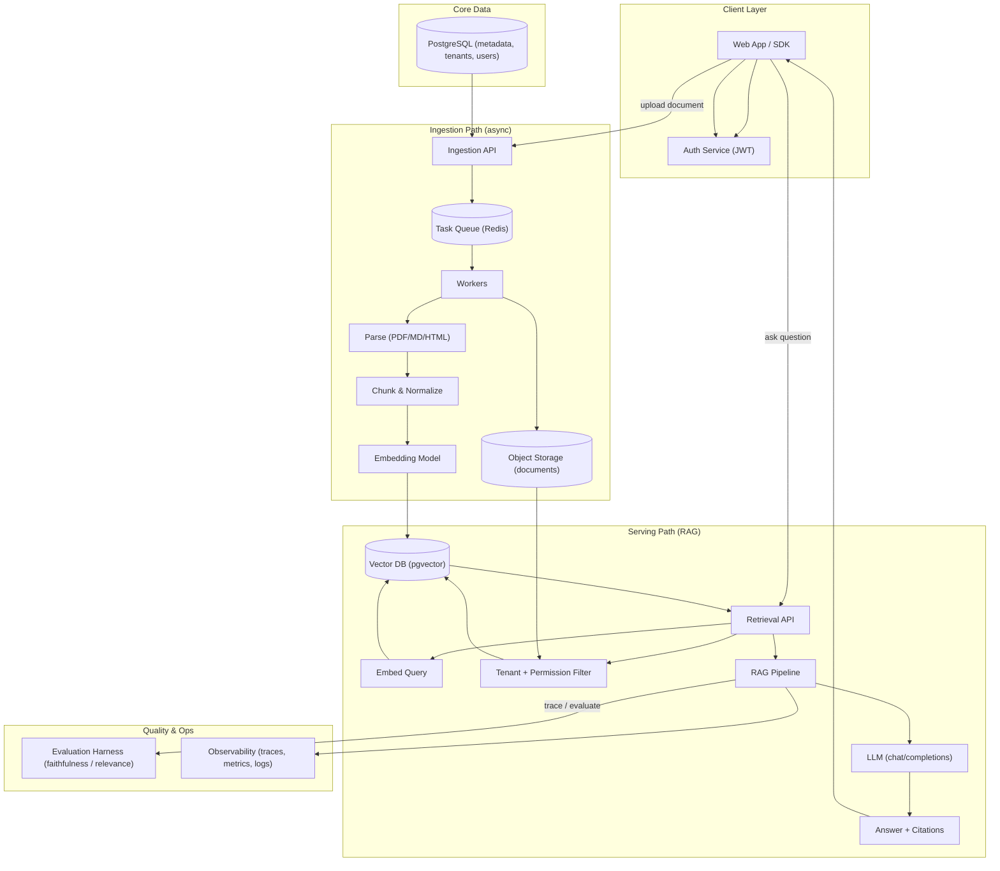

# KnowFlow

**A multi-tenant AI knowledge platform — ingest documents, retrieve with vectors, answer with RAG, backed by citations, evaluation, and observability.**

This is not "a chatbot that reads PDFs." It is a production-shaped knowledge system: asynchronous document ingestion, semantic retrieval, permission-aware RAG, source citations, an evaluation harness, authentication, and a deployment story — engineered as an isolated multi-tenant service.

---

## The Problem

Teams and products sit on a pile of private documents (PDFs, Markdown, web pages, spreadsheets). Generic LLM chat can't answer from them: the model never saw the data, hallucinates freely, and leaks context. Manually curating FAQs doesn't scale.

**KnowFlow** solves this by making documents *retrievable and answerable* — where every answer is grounded in a source chunk the caller is actually allowed to see.

## What KnowFlow Does

| Capability | What it means operationally |
|---|---|
| **Multi-tenant isolation** | Tenants share infrastructure but never share data. Every ingestion and every query is scoped by `tenant_id` + permission metadata at the database level. |
| **Asynchronous ingestion** | Upload a document → it is *queued*, then processed (parse → chunk → embed → index) out-of-band. Fast API, no blocking. |
| **Semantic retrieval** | Questions become vectors; nearest-neighbor search in the vector index replaces brittle keyword matching. |
| **RAG with citations** | Only retrieved, permission-filtered chunks enter the model's context. Answers cite the source chunk(s) they came from. |
| **Evaluation harness** | RAG output is scored (faithfulness, answer relevance, context precision/recall) so changes are measured, not guessed. |
| **Observability** | Every ingestion and every RAG request is traced — token use, latency, and retrieval quality per query. |
| **Authentication** | JWT-based auth, per-tenant credentials and scoped API keys. |

## Architecture



### Why these pieces

- **pgvector not a standalone vector DB** — vectors live beside the relational metadata, so tenant and permission filtering happens in one query with one transaction story. Fewer moving parts, easier correctness.
- **A queue, not synchronous processing** — documents are large and slow to chunk/embed. Sync uploads would time out; a queue gives retries, backpressure, and a clean worker boundary.
- **Permission filtering *inside* retrieval** — this is the differentiator. Filtering is applied to the vector search query itself, so a caller literally cannot retrieve chunks they're not allowed to see — before the LLM ever sees a token.
- **Citations as a product feature** — the answer is only as trustworthy as its source. Every claim links to the chunk and document it came from.

## Planned Tech Stack

| Layer | Choice |
|---|---|
| API | Python · FastAPI · Pydantic · SQLAlchemy |
| Data | PostgreSQL + pgvector |
| Queue | Redis + async workers (ARQ / Celery) |
| Embeddings / LLM | OpenAI-compatible API (swappable) |
| Auth | JWT + per-tenant scoping |
| Object storage | S3-compatible (MinIO locally) |
| Chunking | Structural + overlap-aware splitter |
| Evaluation | RAGAS-style metrics, local harness |
| Observability | OpenTelemetry + structured logs |
| Deployment | Docker Compose (local) → cloud (production) |

## 30-Day Build Roadmap

Every day ends with a runnable, testable increment. The spine holds across all weeks: ingest → index → retrieve → answer → evaluate.

### Week 1 — AI + Architecture Foundation
- **Day 1** ✅ Understand the system (LLMs, tokens, embeddings, RAG), architecture, README, roadmap
- **Day 2** ✅ Embeddings + vector search — zero-dep TF-IDF prototype (`semantic_search.py`): embedding generation, cosine vs euclidean, vector dimensions, top-K retrieval, vector persistence; demonstrates why real embeddings beat exact-word matching
- **Day 3** ✅ PostgreSQL + pgvector — multi-tenant schema (`db/schema.sql`): organizations, users, documents, chunks, embeddings; HNSW index; seeded demo (`db/seed.py`) proving tenant-filtered top-K vector search and the exact failure mode when the org filter is dropped
- **Day 4** ✅ FastAPI AI service (`ai-service/`) — config via pydantic-settings + `.env`, `/health`, OpenAPI/Swagger at `/docs`, pluggable providers behind clean seams: `/v1/embeddings` (local hash or OpenAI-compatible) and `/v1/chat/completions` (mock or OpenAI-compatible); Dockerfile + 8 pytest tests green
- **Day 5** ✅ Node.js backend foundation (`backend/`) — Fastify + TypeScript (ESM, NodeNext), zod-validated env config, pg pool to the Day-3 database, JSON-envelope error handler, JSON-Schema request validation (strict ajv), pino logging, security + request-id middleware, `/health` with live DB probe, graceful shutdown; 10 vitest tests incl. real-PG integration
- **Day 6** ✅ Secure auth (`backend/`) — register (creates a tenant + owner in one DB transaction), login with per-tenant email disambiguation, bcryptjs password hashing, `@fastify/jwt` access tokens (fast-jwt: HS256, 15 min, `iss` claim + `allowedIss` verified), opaque single-use refresh tokens stored sha256-hashed in a new `refresh_tokens` table with rotation + revocation (replay of a rotated token fails), `requireAuth` / `requireRole` guards, protected `GET /api/v1/me`; 24 vitest tests green incl. live-PG auth lifecycle
- **Day 7** ✅ Architecture review — `docs/architecture.md`: as-built diagram vs the Day-1 plan, validated decisions, honest gaps (unprotected AI service, tenancy by convention not RLS, hand-run migrations), API versioning convention, debt register with owners; fixed `updated_at` staleness with migration `003` (trigger), verified the backend `Dockerfile` builds at last, tagged **v0.1.0**

### Week 2 — Ingestion Pipeline
- **Day 8** — Queue infrastructure (Redis + workers)
- **Day 9** — Document parsing (PDF/Markdown/HTML)
- **Day 10** — Chunking strategies + metrics
- **Day 11** — Embedding service + vector indexing
- **Day 12** — Object storage integration
- **Day 13** — Retry/backoff/failure handling; ingestion observability
- **Day 14** — End-to-end ingestion demo; indexing quality check

### Week 3 — Retrieval, RAG, and the Q&A Experience
- **Day 15** — Retrieval API: embed query, vector search, tenant filter
- **Day 16** — Permission-aware hybrid filtering (metadata + vector)
- **Day 17** — RAG pipeline: prompt design, context assembly, guardrails
- **Day 18** — Citations: source chunk plumbing to the response
- **Day 19** — Refinement: query rewrite, top-K tuning, re-scoring
- **Day 20** — Evaluation harness: faithfulness/relevance metrics over a golden set
- **Day 21** — Q&A completeness; demo video of a cited answer

### Week 4 — Hardening & Production Story
- **Day 22** — Error handling, rate limiting, validation hardening
- **Day 23** — Observability: OpenTelemetry traces for login→ingest→answer
- **Day 24** — Tests: unit, integration, and retrieval-quality regression
- **Day 25** — Load test: concurrency, latency SLOs, index tuning
- **Day 26** — Documentation: setup guide, API reference, architecture updates
- **Day 27** — Docker Compose local deploy; one-command boot
- **Day 28** — Cloud path: migrations, secrets, scaling notes
- **Day 29** — Security pass: multi-tenant data-leak regression tests
- **Day 30** — Portfolio polish: README, demo, screening questions, wrap-up

> This roadmap is the living contract. Each day's work updates the README so the repository always tells the current story.

## Status

**Day 7 of 30 — Week 1 complete; architecture review + v0.1.0.**

The review (full write-up in [`docs/architecture.md`](docs/architecture.md)) audited every component built in Week 1 and told the honest truth about the seams: backend (Fastify/:3000, auth + error-enveloped API) and AI service (FastAPI/:8001, OpenAI-compatible providers) are both real and tested, but not yet wired together — retrieval and ingestion are Week 2. Deliberate conventions were set and documented: system routes unversioned (`/health`, `/auth/*`), business routes under `/api/v1/`; backend returns error envelopes, the AI service returns raw OpenAI shapes.

One real bug fixed on review day: `documents.updated_at` (and the missing `users.updated_at`) never changed — a document could sit at `processing` forever while timestamps told you nothing. Migration `003_schema_hygiene.sql` adds a `touch_updated_at()` trigger and it is applied live. Also retired the last unbuilt artifact: the backend `Dockerfile` now **builds** (multi-stage, `node:20-slim`, verified image). The remaining debt is registered with owners and days: no migration runner (Day 27), unprotected AI service (Days 15-17), tenancy by convention until row-level security (Day 29), no auth rate limiting (Day 22).

```bash
cd backend && npm run typecheck && npm test   # 24 tests, all green
cd ../ai-service && source .venv/bin/activate && python -m pytest   # 8 tests, all green
git tag   # v0.1.0
```

> This roadmap is the living contract. Each day's work updates the README so the repository always tells the current story.

_Committed to the build: every feature above will be real, runnable, and verified — not mocked._