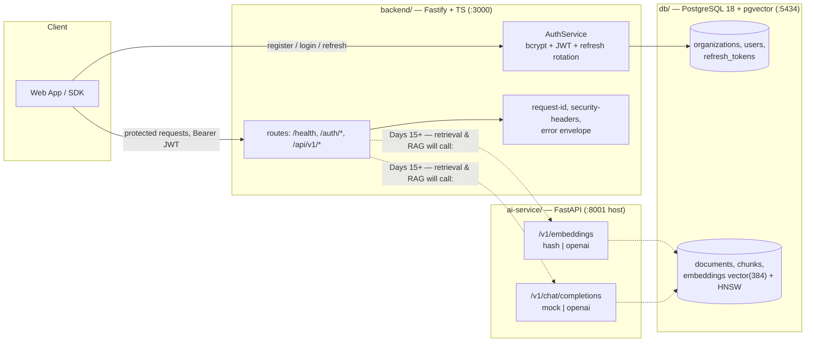

# KnowFlow Architecture — Day 7 Review

> This document is the as-built record of Week 1. The Day-1 README diagram was
> the plan; this is what actually runs, what was validated, what smells, and
> what we fixed on the review day. Every claim below was re-verified against
> the live system on Day 7.

## 1. As-built diagram

Solid = implemented and verified. Dashed = planned (later days).

Painting the picture of what is *not* yet connected is the most honest part of
a Week-1 review: the backend and the AI service are both real and tested, but
they are not wired to each other yet. Nothing reaches the vector store except
the Day-3 seed script. Ingestion and retrieval are the *next* week of work.

## 2. Component inventory

| Piece | Language/Stack | Entry point | Port | Contract |
|---|---|---|---|---|
| `backend/` | TypeScript (ESM, strict), Fastify 5, pg | `src/server.ts` | 3000 | Client-facing API |
| `ai-service/` | Python 3.12, FastAPI, httpx | `app/main.py` | 8001 (host) / 8000 (container) | OpenAI-compatible internal util |
| `db/` | PostgreSQL 18 + pgvector 0.8.6 | `db/schema.sql` + `backend/src/database/migrations/` | 5434 | relational + vector store |
| `semantic_search.py` | zero-dep Python | standalone script | — | Day-2 lesson artifact |

## 3. Architecture review

### Validated decisions (keep)

- **SQLite-pgvector over a standalone vector DB.** Vectors sit beside the
  tenant metadata so one query does "filter by org AND nearest-neighbor."
  The HNSW index (`vector_cosine_ops`, `m=16, ef_construction=64`) answers
  the Day-3 demo at sub-millisecond scale for the seed corpus.
- **Two languages on purpose.** Python for AI providers (fast to port, rich
  model ecosystem), Node for the always-hot client API (cheap streaming, one
  toolchain). They communicate by HTTP with OpenAI-compatible payloads, which
  makes either side replaceable.
- **Provider seams, not branches.** `ai-service/app/services/` exposes a
  `Protocol`; switching `hash` → `openai` is a config change
  (`EMBEDDING_PROVIDER`, `LLM_PROVIDER`), validated at startup by
  `services/__init__.py` fail-fast. The backend mirrors this with
  `buildApp({ config, pool })` dependency injection — every test injects a
  fake pool.
- **Auth chosen for portfolio-grade posture.** bcryptjs cost 10; access
  tokens HS256 @15 min with issuer verified (`allowedIss`); refresh tokens are
  256-bit opaque values stored only as sha256, rotated on every use so replay
  of a leaked token fails. This is genuinely above the demo-service bar.
- **Tests that talk to reality.** Both stacks run unit tests with fakes *and*
  DB-guarded integration tests (`itDb` skip pattern) so a broken schema or a
  dead container surfaces as a red test, not a runtime surprise.

### Honest gaps (not fixed, by design — tomorrow's work)

1. **The AI service is an open trust boundary.** `ai-service/:8001` answers
   anyone who can reach it; no API key, no JWT. Acceptable while it's a local
   utility, *unacceptable* the moment it is on a network. Fixes: backend-side
   API-key auth when wiring Days 15-17, or confine it to Docker's internal
   network (Day 27).
2. **Tenant isolation is convention, not enforcement.** Every tenant-owned
   table carries `organization_id` and Day-3/seed and Day-6 repos filter on it —
   but nothing *forces* a query to filter (the seed script ships a live
   cross-tenant-leak demo). Row-Level Security is Day 29's explicit task; the
   demo exists so the lesson is not forgotten.
3. **Migrations are applied by hand.** `schema.sql` (Day 3) was the de-facto
   migration 001, then `002_auth.sql`, then today `003_schema_hygiene.sql` —
   all piped into the container by hand. There is no version table and no
   runner, which will hurt the moment two environments drift. A tiny runner
   (or even a verified `entrypoint.sh`) is Day-27 deployment work.
4. **`/api/v1/echo` ships in the API.** It exists to prove strict JSON-Schema
   validation and powers tests. Keep it, but it is demo surface; gate or drop
   it before anything public.

## 4. Database schema review

### Fixed today (migration `003_schema_hygiene.sql`)

- **`updated_at` never moved.** `documents.updated_at` existed but nothing
  maintained it; a parser changing `status` queued→processing→ready would
  leave the timestamp frozen at `created_at`. Added a `touch_updated_at()`
  BEFORE-UPDATE trigger on `documents` and `users` (the users table also got
  its missing `updated_at` column — Day-6 `last_login_at` bumps were its only
  writes). Applied and verified live.

### Verified OK

- FK cascade graph is a clean tree: `org → {users, documents} → chunks →
  embeddings`, plus `users → refresh_tokens`. Deleting a tenant cannot orphan
  rows.
- `UNIQUE (organization_id, email)` matches the multi-tenant premise; slugs
  are `UNIQUE`; `chunks (document_id, seq)` is `UNIQUE`; embedding rows are
  `UNIQUE (chunk_id, model)` so multiple models can coexist per chunk.
- Indexing matches access patterns: B-trees on `organization_id`, HNSW for
  ANN, trigram GIN on `chunks.content` ready for hybrid search.
- `documents.uploaded_by` intentionally does **not** cascade (default NO
  ACTION): deleting a user that uploaded documents must fail loudly, not
  silently destroy provenance.

### Noted, not changed

- HNSW `m=16`/`ef_construction=64` are fine for a few thousand vectors; the
  ANN recall should be re-tuned when the corpus gets real (Day 25 load test).
- RLS remains the umbrella item (Day 29).
- `refresh_tokens` is append-only growth — a retention sweep (delete rows where
  `expires_at < now()`) is worth scheduling with ingestion observability.

## 5. API structure review

| Route | Service | Status |
|---|---|---|
| `GET /health` | backend | up |
| `POST /auth/register`, `/login`, `/refresh`, `/logout` | backend | up |
| `GET /api/v1/me` | backend (protected) | up |
| `POST /api/v1/echo` | backend (validation demo) | up |
| `GET /health`, `POST /v1/embeddings`, `POST /v1/chat/completions` | ai-service | up |

- **Versioning convention (set deliberately today):** system routes
  (`/health`, `/auth/*`) are unversioned; business resources live under
  `/api/v1/`. Rationale: auth health and infrastructure contracts fold into
  "platform", resources evolve with business. Documented here so later days are
  consistent rather than accidental.
- **Two envelope styles, and that is fine.** The client API returns
  `{ error: { code, message, details? } }` always; the AI service returns raw
  OpenAI shapes (`{ data: [...] }`, `{ choices: [...] }`). They serve
  different consumers — one external human/SPA contract, one internal
  drop-in-compatible model gateway. Never cross them.
- **Error codes are stable and tested** (`VALIDATION_ERROR`, `UNAUTHORIZED`,
  `INVALID_CREDENTIALS`, `INVALID_REFRESH_TOKEN`, `MULTIPLE_ACCOUNTS`,
  `EMAIL_TAKEN`, `FORBIDDEN`, `NOT_FOUND`, `INTERNAL_ERROR`).
- **Deferred:** CORS for a web client, OpenAPI/Swagger on the backend,
  rate-limiting on `/auth/*` (brute-force) — all Day 22/27 work.

## 6. Technical debt register

| # | Debt | Severity | Status |
|---|---|---|---|
| 1 | Backend `Dockerfile` never built | high (untested artifact) | **verified on Day 7** — `docker build` passes (see below) |
| 2 | `updated_at` trigger missing | medium (silent staleness) | **fixed** — migration `003` |
| 3 | No migration runner / version table | medium (env drift) | deferred — Day 27 |
| 4 | AI service unprotected on network | high (trust boundary) | deferred — Days 15-17 / 27 |
| 5 | No RLS / enforced tenant scoping | high (isolation) | deferred — Day 29 |
| 6 | `/api/v1/echo` demo surface | low | keep + gate later |
| 7 | `refresh_tokens` retention sweep | low | scheduled with Day 13 |
| 8 | No rate limiting on auth | medium | deferred — Day 22 |
| 9 | Pool tuning + test parallelism | low | **fixed** — vitest `fileParallelism: false` (Day-7 flake: two integration files sharing one container starved a pool-client fetch past its 2.5s timeout, making `/health` intermittently "degraded"); revisit pool sizing under real load on Day 25 |

### Day-7 verification record

- `npm run typecheck` + `npm test` → **24/24 pass**
- pytest on `ai-service` → **8/8 pass**
- `docker build` of `backend/` → **passes** (multi-stage, image tagged `review`)
- migration `003` applied to the live container; trigger rollout confirmed

## 7. Dev-log notes worth keeping

- **Fastify encapsulation is the #1 footgun.** Hooks registered inside a
  `register`ed plugin only apply within that plugin's encapsulated context;
  middleware meant to be app-global must wrap itself in `fastify-plugin`
  (see `backend/src/middleware/*`). Same trap bites Fastify v5's ajv: the
  default `removeAdditional: true` silently strips unknown payload fields —
  `backend/src/app.ts` sets `ajv.customOptions.removeAdditional: false` so
  `additionalProperties: false` really rejects.
- **`@fastify/jwt` v9 is fast-jwt, not jsonwebtoken.** The issuer option is
  `iss` (sign) and `allowedIss` (verify), not `issuer`. The error message
  says it reads like a type error and smells like a version bump.
- **bcryptjs was a deliberate choice** over native `bcrypt` — pure JS, no
  prebuilt binaries, cost 10 is fast enough at this scale.